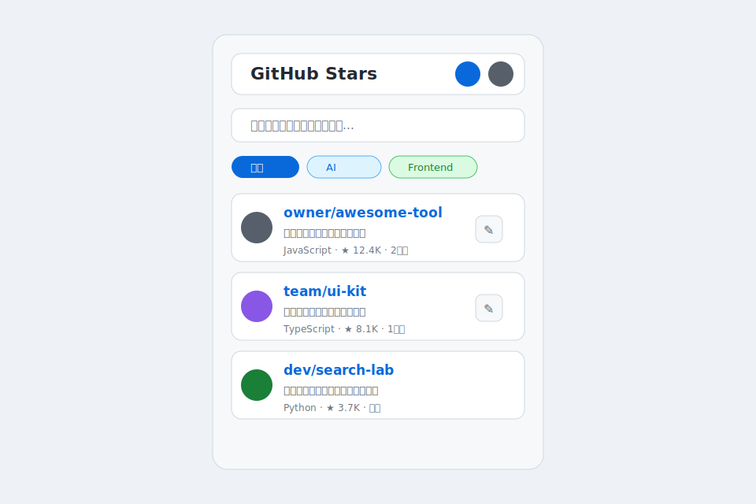
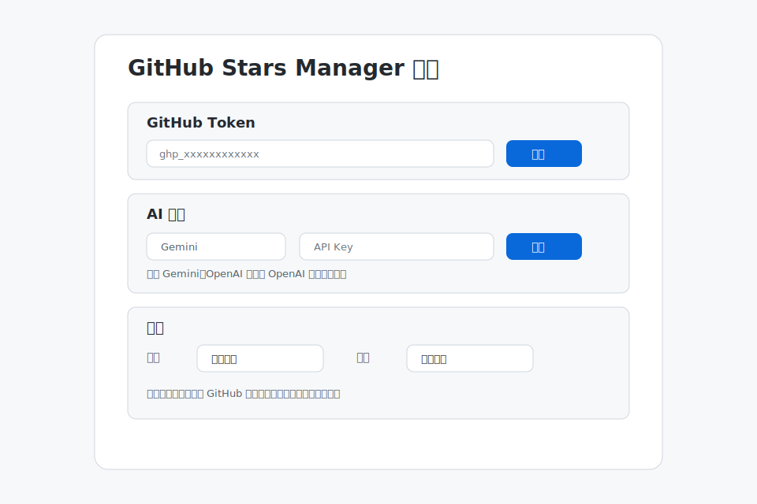
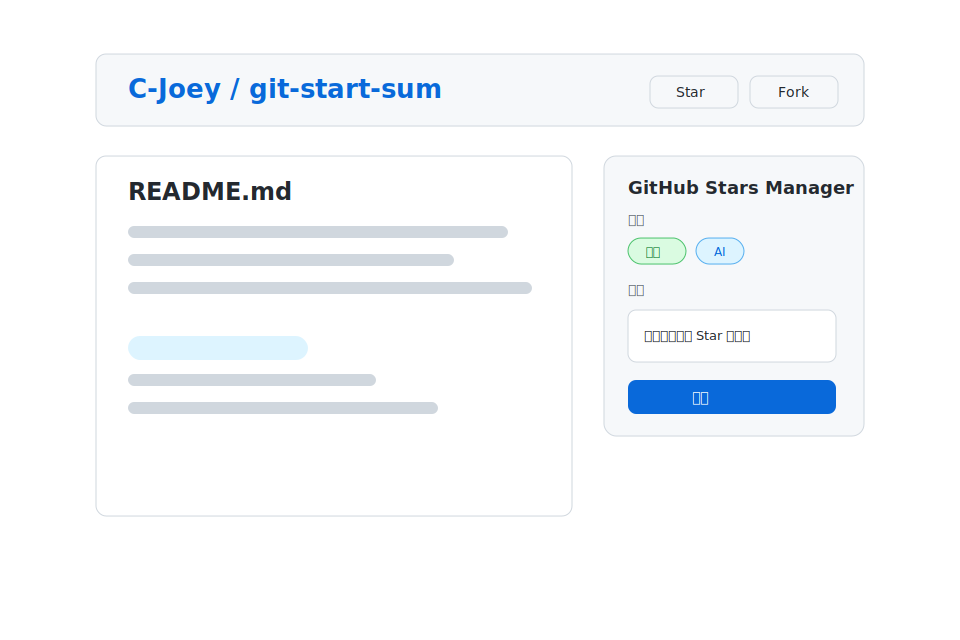
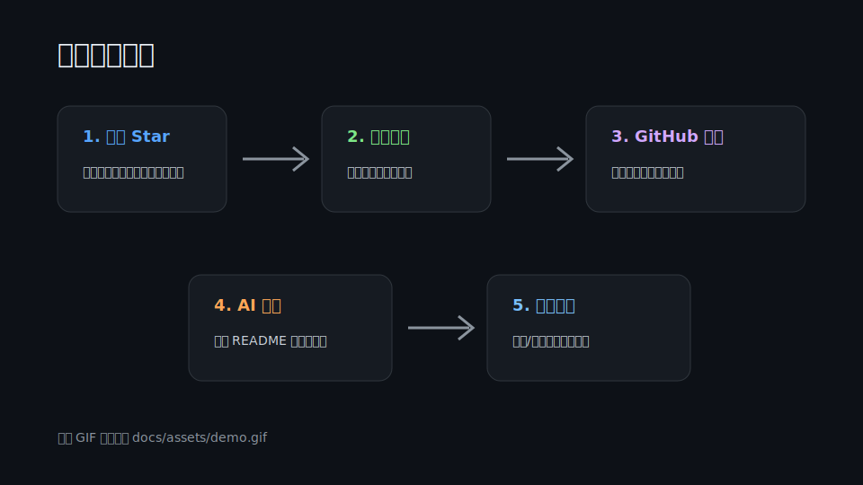

# GitHub Stars Manager

[中文](./README.md) | [English](./README_en.md)

GitHub Stars Manager is a native Manifest V3 Chrome extension that turns GitHub Stars into a searchable, tagged, annotated, and syncable personal project knowledge base.

It is designed for developers who star many repositories, revisit projects for technical decisions, add personal notes or tags, generate optional AI summaries, and keep the data in their own GitHub repository.

Project URL: <https://github.com/C-Joey/git-start-sum>


## Features

- **Star management**: load GitHub starred repositories, search them, filter by tag, and open repositories quickly.
- **Tags and notes**: add custom tags and personal notes; search matches repository metadata, tags, notes, and AI summaries.
- **AI summaries**: supports Google Gemini API, OpenAI, OpenAI Responses API, Chat Completions, and custom OpenAI-compatible endpoints.
- **GitHub page panel**: edit notes and tags directly on GitHub repository pages.
- **Browsing history**: optionally record visited GitHub repository pages with deduplication and size limits.
- **Cloud sync**: sync tags, notes, AI summaries, cached stars, and browsing history to your own GitHub repository.
- **Export**: export Markdown and JSON data, including cached Stars and metadata.
- **Theme and language**: supports system, light, and dark themes; UI supports Simplified Chinese and English.
- **Linux IME workaround**: open the popup as a regular browser tab to avoid Chrome extension popup focus issues with Fcitx/Fcitx5/IBus.

## Screenshots

<table>
  <tr>
    <td width="50%">
      
    </td>
    <td width="50%">
      
    </td>
  </tr>
  <tr>
    <td width="50%">
      
    </td>
    <td width="50%">
      
    </td>
  </tr>
</table>

## Quick Start

The extension is not published to the Chrome Web Store yet. Load it as an unpacked extension.

1. Download this project, or clone it:

   ```bash
   git clone https://github.com/C-Joey/git-start-sum.git
   ```

2. Open Chrome and go to `chrome://extensions/`.
3. Enable **Developer mode**.
4. Click **Load unpacked**.
5. Select the project root directory.
6. Open the extension and configure your GitHub Token.

After updating files, reload the extension from `chrome://extensions/`.

## GitHub Token

Create a GitHub Personal Access Token and paste it into the options page. A classic token is recommended for simpler permissions.

| Scenario | Recommended permission |
| --- | --- |
| Public starred repositories only | Basic authenticated GitHub API access |
| Private Stars / private repositories | `repo` scope |
| Create and write sync repository | `repo` scope |
| Gist | Not required in the current version |

The token is stored in Chrome extension local storage and is only used for GitHub API requests. Do not commit or share it.

### GitHub API Proxy

The options page supports a GitHub API proxy. When left empty, the extension uses:

```text
https://api.github.com
```

If you use a proxy, make sure API paths return GitHub API JSON, not HTML pages. The extension runs a `HEAD /user` preflight check. If the proxy returns an HTML page such as a Cloudflare Challenge, validation will fail.

## Sync Repository

When cloud sync is enabled, the extension writes data to your configured GitHub repository. A private repository is recommended.

Default sync repository name:

```text
my-github-stars
```

Synced files:

- `data.json`: structured data including tags, notes, AI summaries, cached Stars, settings, and history.
- `README.md`: human-readable Star summary.
- `HISTORY.md`: browsing history summary, depending on whether history recording is enabled.

The sync section includes an **Open** button that opens:

```text
https://github.com/<your-login>/<sync-repo-name>
```

If the GitHub login has not been cached locally, the extension calls `/user` with the current token before opening the repository.

## AI Configuration

AI is optional. Tags, notes, search, history, sync, and export work without it.

Supported providers:

- **Google Gemini API**
- **OpenAI**
- **Custom OpenAI-compatible endpoint**

OpenAI-related settings:

| Field | Description |
| --- | --- |
| API URL | Defaults to `https://api.openai.com`; can be replaced with a gateway URL |
| API Type | Supports `Responses API` and `Chat Completions` |
| Model | Select from loaded models or enter manually |

If you enter a base URL, the extension appends either `/v1/responses` or `/v1/chat/completions` according to the selected API type. If you enter a full endpoint path, the extension detects the API type from the path.

AI generation uses the repository name, description, first 500 characters of the README, and available tags. It returns a short summary and 1 to 3 tag suggestions.

## Usage

### Search

Search matches:

- repository name
- repository description
- language
- topics
- tags
- notes
- AI summaries

On Linux, if Chinese/Japanese/Korean input cannot be activated in the popup, click **Open in tab** in the popup header and use the extension page in a normal browser tab.

### Tags

- The home filter bar only shows tags that currently have repositories.
- Tags with zero repositories remain visible in tag management.
- In Chinese UI, some legacy English default tags are displayed as Chinese labels.
- When a Chinese label maps to an existing legacy tag, the extension reuses the original tag to avoid duplicates.

### Notes and AI Summaries

Each repository can store both a personal note and an AI summary.

List preview behavior:

- If there is no note, the AI summary is shown.
- If the note is short, both note and AI summary are shown.
- If the note is long, the personal note is prioritized to keep the list compact.

The edit modal always keeps notes and AI summaries in separate sections.

### GitHub Page Panel

On GitHub repository pages, the injected panel can:

- show existing notes and tags
- edit notes
- add or remove tags
- generate AI summaries

If GitHub navigation causes stale injected UI, refresh the current GitHub page.

### Export

The options page can export:

- `github-stars.md`
- `github-stars-data.json`

Exported data includes cached Stars, not only repositories with notes. Tags, notes, AI summaries, repository metadata, and browsing history are preserved as much as possible.

## Linux IME Notes

On Linux desktop environments, Chrome extension popups may fail to activate Fcitx, Fcitx5, or IBus because the popup is a temporary extension window and input method frameworks may not receive the expected focus state.

Recommended workaround:

1. Click **Open in tab** in the popup header.
2. The extension opens `popup/popup.html` in a normal browser tab.
3. Use search, tags, and notes there.

Normal browser tabs usually work correctly with system input methods.

## Data and Privacy

- Extension data is stored primarily in Chrome extension local storage.
- Cloud sync writes only to the GitHub repository you configure.
- Browsing history records only GitHub repository pages.
- AI is called only when you explicitly trigger summary generation.
- AI requests include repository name, description, truncated README content, and candidate tags.
- GitHub Token and AI Key are stored locally in extension settings and are not written to generated Markdown summaries.

## Troubleshooting

### Empty Popup

1. Confirm the GitHub Token is configured and saved.
2. Click the token validation button in the options page.
3. Confirm access to `github.com` and `api.github.com`.
4. Reload the extension from `chrome://extensions/` after code updates.

### Private Repositories Missing

1. Confirm the token includes the `repo` scope.
2. If using a fine-grained token, confirm it covers the target repositories and permissions.
3. Save the token and reopen the popup or extension tab.

### Sync Failed

1. Confirm the sync repository name.
2. Confirm the token can create and write repositories.
3. If the repository already exists, confirm the token has write access.
4. Check API proxy, firewall, and rate limit issues.
5. If using an API proxy, make sure Cloudflare Challenge is disabled on API paths.

### AI Failed

1. Confirm the API Key.
2. Confirm the API URL and API type match.
3. Confirm the model is available for the current account or gateway.
4. For custom services, confirm compatibility with the selected API type.

### Theme or Language Did Not Update

1. Save settings in the options page.
2. Close and reopen the popup.
3. Refresh GitHub repository pages that already had the injected panel.
4. Reload the extension after code updates.

## Tech Stack

- Manifest V3
- Plain HTML / CSS / JavaScript
- Chrome Storage API
- Chrome Tabs / Alarms API
- GitHub REST API
- Gemini API
- OpenAI Responses API / Chat Completions

There is no build system. Chrome loads the extension files directly from this repository.

## Development

After local edits:

1. Open `chrome://extensions/`.
2. Reload the extension card.
3. Check popup Star list, search, tags, and options page.
4. Open any GitHub repository page and verify the injected notes/tags panel.
5. If AI, sync, or export logic changed, verify the related buttons and error states.

Basic syntax checks:

```bash
node --check popup/popup.js
node --check options/options.js
node --check background/service-worker.js
```

JSON validation:

```bash
node -e "const fs=require('fs'); for (const f of ['manifest.json','_locales/en/messages.json','_locales/zh_CN/messages.json']) JSON.parse(fs.readFileSync(f,'utf8'));"
```

## License

MIT License.
