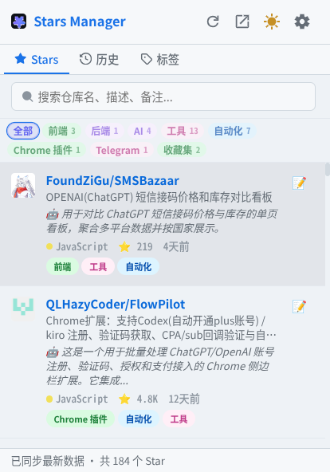
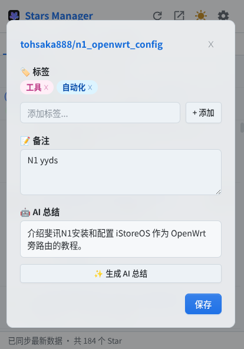
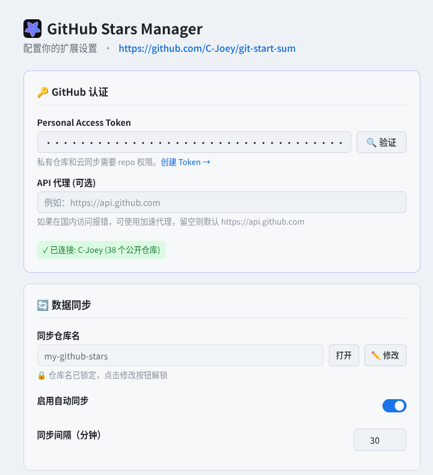
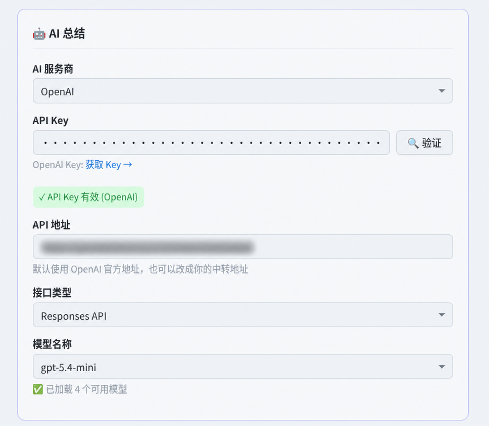

# GitHub Stars Manager

[中文](README.md) | [English](README_en.md)

[](https://github.com/C-Joey/git-start-sum/actions/workflows/package.yml)
[](https://github.com/C-Joey/git-start-sum/releases)
[](LICENSE)

`GitHub Stars Manager` is a native Manifest V3 Chrome extension that turns GitHub Stars into a searchable, tagged, annotated, and syncable personal project knowledge base.

It is designed for developers who star many repositories, revisit projects for technical decisions, add personal notes or tags, generate optional AI summaries, and keep the data in their own GitHub repository.

## Links

| Resource | URL |
| --- | --- |
| GitHub | https://github.com/C-Joey/git-start-sum |
| Releases | https://github.com/C-Joey/git-start-sum/releases |
| Latest package | https://github.com/C-Joey/git-start-sum/releases/latest |
| GitHub Actions | https://github.com/C-Joey/git-start-sum/actions/workflows/package.yml |

## Purpose

GitHub Stars Manager is not a public bookmark site or a hosted SaaS. It runs in your browser, uses the GitHub Token you configure to read Stars, and can optionally sync tags, notes, AI summaries, cached Star data, and browsing history to your own GitHub repository.

This repository does not include a hosted backend, real user data, GitHub Tokens, AI Keys, or usable private configuration. Sensitive settings are stored in Chrome extension local storage by default.

## Capabilities

| Area | Capability |
| --- | --- |
| Star management | Read GitHub starred repositories, search them, filter by tag, open repositories quickly, and cache basic metadata. |
| Tags and notes | Store custom tags and personal notes; search matches repository metadata, topics, tags, notes, and AI summaries. |
| AI summaries | Support Google Gemini API, OpenAI Responses API, OpenAI Chat Completions, and custom OpenAI-compatible endpoints. |
| GitHub page panel | Inject a notes/tags panel into GitHub repository pages for viewing, editing, and AI summary generation. |
| Browsing history | Optionally record visited GitHub repository pages to recover projects you recently viewed but have not organized. |
| Cloud sync | Write structured data to the GitHub repository you configure; a private repository is recommended. |
| Export | Export Markdown and JSON, including cached Stars, not only repositories with notes. |
| Theme and language | Support system, light, and dark themes; UI supports Simplified Chinese and English. |
| Linux IME workaround | Open the popup as a normal browser tab to avoid Chrome popup focus issues with Linux input methods. |

## Architecture

```text
Chrome extension  ->  GitHub REST API
                  ->  Gemini / OpenAI / OpenAI-compatible API
                  ->  Your sync repository on GitHub
```

- The extension runs directly in Chrome. There is no backend service or database.
- The GitHub Token is only used for GitHub API requests.
- The AI Key is only used when you explicitly generate a summary.
- The sync repository is configured and controlled by you. A private repository is recommended.
- If you use a GitHub API proxy, API paths must return GitHub API JSON, not HTML pages such as Cloudflare Challenge responses.

## Screenshots

<table>
  <tr>
    <td width="50%" align="center">
      
    </td>
    <td width="50%" align="center">
      
    </td>
  </tr>
  <tr>
    <td width="50%" align="center">
      
    </td>
    <td width="50%" align="center">
      
    </td>
  </tr>
</table>

## Requirements

| Component | Requirement |
| --- | --- |
| Browser | Chrome / Chromium / Edge with Manifest V3 support |
| GitHub account | Required for reading Stars and optional cloud sync |
| GitHub Token | Required for GitHub API access |
| AI Key | Optional, only required for AI summaries |
| Build system | Not required; Chrome loads extension files directly |

## Quick Start

### 1. Download the Extension

Download the latest package from [GitHub Releases](https://github.com/C-Joey/git-start-sum/releases/latest):

```text
github-stars-manager-vX.Y.Z.zip
```

Extract it to a local directory.

You can also load the repository from source:

```bash
git clone https://github.com/C-Joey/git-start-sum.git
```

### 2. Load into Chrome

1. Open `chrome://extensions/`.
2. Enable **Developer mode**.
3. Click **Load unpacked**.
4. Select the extracted package directory or this repository root.
5. Open the extension and configure your GitHub Token.

After updating files or replacing the package, reload the extension from `chrome://extensions/`.

## GitHub Token Permissions

The token is not for the source repository `C-Joey/git-start-sum`; it is used by the extension to read your GitHub Stars and write to the sync data repository you configure.

| Token type | Use case | Permission notes |
| --- | --- | --- |
| Classic token | Easiest setup; works for reading Stars, creating the sync repository, and writing data | Enable the `repo` scope. Note that `repo` is broad and covers private repositories your account can access. |
| Fine-grained token | Safer setup when the extension should only write to one fixed data repository | Create the sync repository first, for example `my-github-stars`, set Repository access to that repository only, and grant `Contents: Read and write`. |

For quick setup, a classic token with the `repo` scope is the simplest option. For least privilege, use a fine-grained token scoped only to the sync data repository. The current version does not require `gist` permission.

The token is stored in Chrome extension local storage and is only used for GitHub API requests. Do not commit or share it, and do not make your sync data repository public unless you intentionally want to publish that data.

## Sync Repository

When cloud sync is enabled, the extension writes data to your configured GitHub repository. A private repository is recommended.

Default sync repository name:

```text
my-github-stars
```

Synced files:

| File | Description |
| --- | --- |
| `data.json` | Full structured data, including tags, notes, AI summaries, cached Stars, settings, and history. |
| `README.md` | Human-readable Star summary. |
| `HISTORY.md` | Browsing history summary, depending on whether history recording is enabled. |

The sync section includes an **Open** button that opens:

```text
https://github.com/<your-login>/<sync-repo-name>
```

If the GitHub login has not been cached locally, the extension calls `/user` with the current token before opening the repository.

## AI Configuration

AI is optional. Tags, notes, search, history, sync, and export work without it.

| Provider | Support |
| --- | --- |
| Google Gemini API | Supported |
| OpenAI Responses API | Supported |
| OpenAI Chat Completions | Supported |
| Custom OpenAI-compatible endpoint | Supported |

OpenAI-related settings:

| Field | Description |
| --- | --- |
| API URL | Defaults to `https://api.openai.com`; can be replaced with a gateway URL. |
| API Type | Supports `Responses API` and `Chat Completions`. |
| Model | Select from loaded models or enter manually. |

If you enter a base URL such as:

```text
https://api.openai.com
```

The extension uses the selected API type to call:

```text
/v1/responses
/v1/chat/completions
```

AI generation reads the repository name, description, and truncated README content. It returns a short summary and 1 to 3 tag suggestions.

## GitHub API Proxy

The options page supports a GitHub API proxy. When left empty, the extension uses:

```text
https://api.github.com
```

If you use a proxy, make sure API paths return GitHub API JSON, not HTML pages. The extension runs a `HEAD /user` preflight check. If the proxy returns an HTML page such as a Cloudflare Challenge, validation will fail.

## Usage

### Search

Popup search matches:

- repository name
- repository description
- language
- topics
- tags
- notes
- AI summaries

On Linux, if Chinese/Japanese/Korean input cannot be activated in the popup, click **Open in tab** in the popup header and use the extension page in a normal browser tab.

### Tags

- The home filter bar only shows tags that currently have repositories.
- Tags with zero repositories remain visible in tag management.
- In Chinese UI, some legacy English default tags are displayed as Chinese labels.
- When a Chinese label maps to an existing legacy tag, the extension reuses the original tag to avoid duplicates.

### Notes and AI Summaries

Each repository can store both a personal note and an AI summary.

- If there is no note, the AI summary is shown in the list.
- If the note is short, both note and AI summary are shown.
- If the note is long, the personal note is prioritized to keep the list compact.
- The edit modal always keeps notes and AI summaries in separate sections.

### GitHub Page Panel

On GitHub repository pages, the injected panel can show existing notes and tags, edit notes, add or remove tags, and generate AI summaries.

If GitHub navigation causes stale injected UI, refresh the current GitHub page.

### Export

The options page can export:

```text
github-stars.md
github-stars-data.json
```

Exported data includes cached Stars, not only repositories with notes. Tags, notes, AI summaries, repository metadata, and browsing history are preserved as much as possible.

## Linux IME Notes

On Linux desktop environments, Chrome extension popups may fail to activate Fcitx, Fcitx5, or IBus because the popup is a temporary extension window and input method frameworks may not receive the expected focus state.

Recommended workaround:

1. Click **Open in tab** in the popup header.
2. The extension opens `popup/popup.html` in a normal browser tab.
3. Use search, tags, and notes there.

Normal browser tabs usually work correctly with system input methods.

## Data and Privacy

- Extension data is stored primarily in Chrome extension local storage.
- Cloud sync writes only to the GitHub repository you configure.
- Browsing history records only GitHub repository pages.
- AI is called only when you explicitly trigger summary generation.
- AI requests include repository name, description, truncated README content, and candidate tags.
- GitHub Token and AI Key are stored locally in extension settings and are not written to generated Markdown summaries.
- This repository does not track `.trellis/`, `.codex/`, or local task notes.

## Project Structure

```text
.
├── manifest.json              # MV3 manifest
├── background/                # Service worker
├── popup/                     # Extension popup page
├── options/                   # Options page
├── content/                   # GitHub page injection scripts and styles
├── lib/                       # Shared storage, GitHub API, AI, and sync modules
├── styles/                    # Shared CSS tokens and base styles
├── icons/                     # Extension icons
├── _locales/                  # English and Simplified Chinese messages
├── docs/assets/               # README screenshots
└── .github/workflows/         # GitHub Actions package workflow
```

## Development and Verification

There is no npm build, lint, or test script. Chrome loads the extension files directly from this repository.

After local edits:

1. Open `chrome://extensions/`.
2. Reload the extension card.
3. Check popup Star list, search, tags, and options page.
4. Open any GitHub repository page and verify the injected notes/tags panel.
5. If AI, sync, or export logic changed, verify the related buttons and error states.

Syntax checks:

```bash
find background content lib options popup -name '*.js' -print0 | xargs -0 -n 1 node --check
```

JSON validation:

```bash
node -e "const fs=require('fs'); for (const f of ['manifest.json','_locales/en/messages.json','_locales/zh_CN/messages.json']) JSON.parse(fs.readFileSync(f,'utf8'));"
```

## Release

GitHub Actions runs on `master` pushes, pull requests, and manual dispatch:

1. Check JavaScript syntax.
2. Validate manifest and locale JSON files.
3. Package the extension zip and upload it as an Actions artifact.

Formal versions are published through [GitHub Releases](https://github.com/C-Joey/git-start-sum/releases). The install package is named:

```text
github-stars-manager-vX.Y.Z.zip
```

## Troubleshooting

### Empty Popup

1. Confirm the GitHub Token is configured and saved.
2. Click the token validation button in the options page.
3. Confirm access to `github.com` and `api.github.com`.
4. Reload the extension from `chrome://extensions/` after code updates.

### Private Repositories Missing

1. Confirm the token includes the required permissions.
2. If using a fine-grained token, confirm it covers the target sync repository and permissions.
3. Save the token and reopen the popup or extension tab.

### Sync Failed

1. Confirm the sync repository name.
2. Confirm the token can create and write repositories.
3. If the repository already exists, confirm the token has write access.
4. Check API proxy, firewall, and rate limit issues.
5. If using an API proxy, make sure Cloudflare Challenge is disabled on API paths.

### AI Failed

1. Confirm the API Key.
2. Confirm the API URL and API type match.
3. Confirm the model is available for the current account or gateway.
4. For custom services, confirm compatibility with the selected API type.

### Theme or Language Did Not Update

1. Save settings in the options page.
2. Close and reopen the popup.
3. Refresh GitHub repository pages that already had the injected panel.
4. Reload the extension after code updates.

## License

MIT License.
